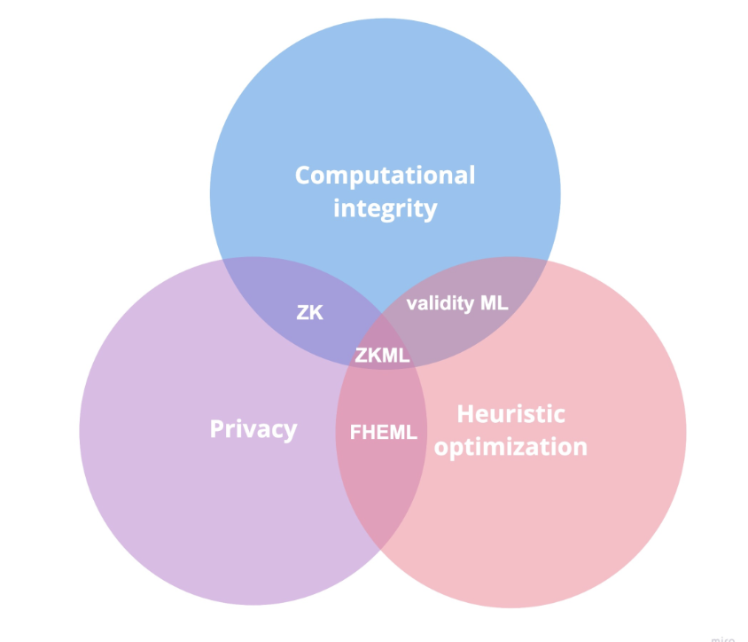

1. 前奏: Endless Night
2. Scroll Talk介绍
	1. Scroll Talk 是 Scroll CN 主理的一档播客节目。我们会通过不同的形式，和 Scroll 团队，Scroll 生态项目方对话，帮助大家更了解 Scroll。
3. 当期节目大概介绍
	1. 本期节目，我们请到了Scroll的联合创始人Haichen Shen，和他一起来聊聊关于Scroll的开发。

# 采访稿

## 个人开场
1. 首先非常感谢Haichen的到来，Haichen是Scroll的联创也是工程团队的Lead，我们可能不经常看到Haichen出现在活动中，但一般每次出现，都会给我们带来很多惊喜的进展。所以大家对Haichen可能相对了解的没有那么多，我们先请Haichen来做下自我介绍（Haichen可以多介绍一些关于自己）

	

2. Haichen 在创立Scroll之前是在亚马逊从事机器学习的相关工作，我相信Haichen在原先行业应该也是工程能力十分强的技术大牛，那是什么契机，或者是什么吸引你来到加密货币领域。

	

3. 因为Haichen之前从事机器学习领域的工程，然后现在又在Crypto领域做着挑战性的ZK赛道。所以在聊聊zkEVM的工程问题之前，我们可以多多聊聊目前的AI和ZK两个赛道，非常想问下 Haichen，你是怎么看待 AI 和 ZK 两个方向现在都非常热门的赛道？你觉得这两项技术的价值点各自在哪里？

	

4. 从机器学习切换到ZK， 最大的挑战是什么？从技术工程看，你觉得哪一个实现难度更高。两项技术有没有什么共通的地方？

	

5. 因为ChatGPT是有点横空出世的感觉，我们很好奇的是，Haichen在你加入Scroll之前，当时AI领域发展是在什么阶段？然后现在突然大模型跑通了，有没有对你造成一定的冲击，比方说没想到技术会发展到现在的情况？

	

6. 自从AI火了之后，出现了Crypto技术人才回流AI的情况。最典型的例子就是美团的王慧文，之前是All in crypto，现在是All in AI。你怎么看待这样的现象。

	

7. ZK和ML都是计算密集型，都需要大量的GPU算力支持。之前Worldcoin有发表过一篇文章，是讲两者融合领域的赛道ZKML。其中的分类是从密码学角度的一个维恩图，三个原语分别是隐私，计算正确性，启发式优化(Heuristic optimization)。从这个角度看，ZKML的技术特性应当是既能保护隐私，确保计算正确性，还能通过像AI一样实现只能推理？Haichen 你怎么看待这个视角？
  

8. 除了Worldcoin ，Haichen你觉得有哪些场景ZKML是有可能对链上，链下的世界带来切实的改变？

	

## 工程团队

感谢Haichen给我们分享的很有深度的见解。接下来我们回到Haichen现在所在做的事儿上。

1. zk赛道也有很多细分的子赛道，毫无疑问zkEVM是其中复杂度最高的之一，Haichen是什么让你一进入加密货币领域，就选择了现在工程难度最大的zkEVM赛道（如果前面的回答已经涉及，自动跳过）。

	

1. Scroll的测试网在目前L2项目方中，在稳定性和性能上一直都是比较靠谱，因为我相信Scroll的工程团队，不管是基础设施团队，还是zk团队，都是业界非常厉害的工程。能不能让Haichen给我们介绍下，现在Scroll工程团队的大概情况，日常的工作流是如何的？

	

1. 20多人的工程团队在区块链行业内已经算比较大的了，从最初组建到现在管理这样的团队过程中有什么样的挑战呢，因为我们知道Scroll的团队相对是比较分布式的，沟通协调肯定会有时差等等的问题。

	

1. 除了团队内部，Scroll 和以太坊基金会的PSE团队也是一直在合作构建以太坊最终zk化的版本。我们很好奇其中合作的一些细节，比方说人员协调分配，然后代码库之间的关联和协作是怎么样的？

	

1. 除了PSE团队，我们也经常看到Scroll和其他在做zk赛道的团队有比较多的交流。现在Scroll和这些团队的合作一般会是以什么样的形式？

	

1. 工程师一般都是比较低调，比较少发表观点，在钻研技术。Haichen 有没有什么推荐，除了你以外，值得开发者关注的一些技术大牛，然后普通开发者可以从中学习，跟近最新的技术进展？

	

## zkEVM

感谢Haichen给我们分享的关于Scroll背后工程师团队的一些情况，我们接下去将深入聊聊zkEVM这个Scroll已经深耕了近2年的项目本身。

1. 首先还是请Haichen大致介绍一下zkEVM最新的架构，方便一些新的开发者了解Scroll，因为关于Scroll架构概览是去年的博客了，看到现在Scroll的一些更新，不知道是不是架构上有了一些调整？

	

2. （此处根据介绍做一些总结，Scroll的节点包含排序器，协调器，中继器，排序器做打包执行交易，协调器负责将执行踪迹分派给证明者网络，中继器监视同时部署在以太坊和Scroll上的Rollup和Bridge合约，负责消息中继。另一部分是证明者网络），Scroll之前有两篇博客可以很方便大家了解zkEVM，第一篇是《以太坊原生zkEVM Rollup介绍》，另一篇是《Scroll的架构概览》，结合今天Haichen所讲解的最新架构更新，应该能比较容易理解Scroll的技术架构。

	

3. 在过去两年，zkEVM的开发实现应该取得了巨大的进步，不管是证明系统的创新，还是硬件加速领域的创新。那现在对于一个工程团队来实现zkEVM，或者是像Visa这样的公司，如果想要应用zkEVM，Haichen你觉得主要的难点在哪里呢

	

4. Scroll 的 zkEVM应该是Type2的zkEVM，但是也有人会认为你们在做的是Type2.5的zkEVM。（这里解释下Type 2类型的zkEVM力求实现完全EVM等效，但不是完全以太坊等效。也就是说，它们“从内部看”与以太坊一模一样，但它们在外部有一些差异，特别是在数据结构方面，如块结构和状态树。Type 2.5是指除gas费外的EVM等效。Type 3类型的zkEVM可能会删除一些在zkEVM中特别难以实现的特性。预编译通常处于最高的优先级；此外，Type 3类型的zkEVM，有时在处理合约代码、内存或堆栈的方式上也存在细微差别）。然后我们都知道开发者非常关心Gas成本，但因为zkEVM本身因为zk证明生成的成本不一样，如果同比例映射，那Gas定价势必要更改，同zk证明生成成本保持一致。想问下Haichen现在是怎么做取舍的，现在的Gas定价和预编译这方面是如何设计的？

	

5. 但是不管是什么类型，从开发者的反响来看。EVM的开发者都对Scroll的兼容性赞赏有佳，几乎不需要更改什么就可以直接部署，这对于项目方扩展业务也是非常有帮助的。然后我们想在深入问下Haichen关于zk电路的问题。因为实际上现在很多的注意力聚焦在证明系统上，没有太多人在看工程实现上的创新。我们有看到Scroll的zkEVM实际上把许多计算复杂度较高或者成本较高的计算都通过查找表给解决了。Haichen有没有什么可以给我们分享的，最近Scroll在工程实现上取的一些创新？

	

6. 谢谢Haichen，关于zk电路，还想替社区的开发者请教一下Haichen，除了你之前提到要转换写程序的思维外，现在开发zk电路的难点主要在哪里？

	

7. 从技术层面，Haichen你是怎么评价现在在做Scroll同类型zkEVM的几个竞争对手，主要包括Polygon zkEVM，Linea，或者有没有我遗漏的？

	

8. 我有在密切关注Scroll Alpha测试网的网络状态，在上线的这几个月内，绝大多数时间，Scroll Alpha测试网都是非常稳健的运行，但是在极个别情况下，依然会出现交易确认延迟的情况。想问下Haichen，这些拥堵的时候，一般都是哪里出现了问题，你们又是如何立马解决的？

	

9. 最后的时间，让我们聊聊Scroll的最新进展吧。我们现在能在官推的每周更新上看到的一些更新。然后官网的路线图上似乎有所变动，在主网上线前又多了一个Sepolia Testnet阶段，这会是一个永久测试网吗？除此之外，Haichen有什么可以和我们分享的内容吗？

	

10. 有许多社区开发者想给Scroll 做贡献，除了给代码库提PR，现在还有什么方式吗？

## 结尾

好的谢谢Haichen，相信在社区导向下，Scroll 的zkEVM一定会在未来有一席之地。
同样我们也希望Haichen，给Scroll 的zkEVM做一些美好的期许。

谢谢Haichen！很开心今天能邀请到Haichen来到我们Scroll CN中文社区。让我们对Scroll可爱的工程师们有了更多的了解，也祝愿Scroll的测试网和未来的主网能稳定运行，穿越牛熊！