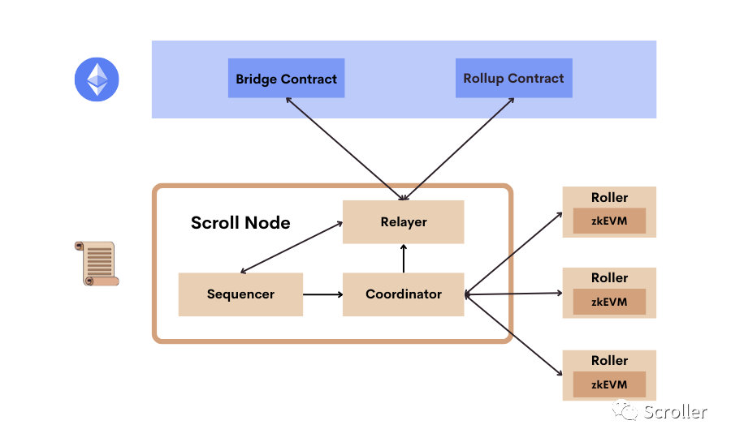
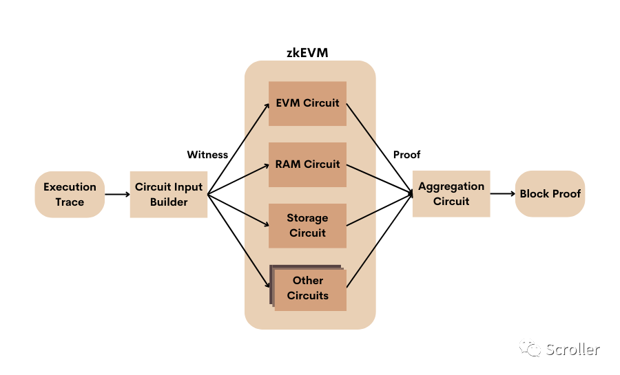

Scroll是一个EVM等效的zkRollup，用于扩展以太坊。从技术上讲，Scroll建立在两个主要部分之上。核心部分是zkEVM，用于证明Layer 2的EVM执行正确性。一年多来，我们一直在与以太坊基金会的隐私和扩容研究院（PSE, Privacy and Scaling Explorations）一起公开构建它。但是要将 zkEVM 变成以太坊上的一个完整的zkRollup，我们还需要围绕它构建一个完整的L2架构。

在这篇文章中，我们将概述Scroll的整体架构。更具体地说，我们将介绍Scroll的初始版本，由中心化排序节点和去中心化证明网络组成。我们致力于在未来去中心化排序节点，并将在未来的文章中分享我们的设计。

# Scroll的架构

------

当前架构由三个基础组件组成（详见图 1）：

- **Scroll节点：** 把用户交易构建成L2区块，然后将它们提交到以太坊基础层上，并在L1和L2之间传递消息。

- **Roller网络：** 生成zkEVM有效性证明以证明交易被正确执行。

- **Rollup和Bridge合约：** 为Scroll交易提供数据可用性，验证zkEVM有效性证明，并允许用户在以太坊和Scroll之间移动资产。

接下来，我们将详细介绍这些组件中每一个的作用。

图 1. Scroll架构

##  Scroll节点

**Scroll节点**是应用和用户与Scroll交互的主要途径。它由三个模块组成，**排序器(Sequencer)**、**协调器(Coordinator)** 和**中继器(Relayer)**。

**排序器**提供JSON-RPC接口并接收L2交易。每隔几秒钟，它就会从L2的内存池中取回一批交易并执行它们，以生成新的L2 块和新的状态根。Scroll的排序器实现基于Go-Ethereum (Geth)，是最主流的以太坊节点实现之一。通过分叉Geth，我们可以实现最佳的兼容性并继承已经经过时间考验的安全性。

一旦生成了一个新的块，**协调器**就会收到通知，并从排序器接收这个块的执行踪迹。然后它将执行踪迹分派给从Roller池中随机选择的Roller以生成证明。

**中继器**监视同时部署在以太坊和Scroll上的Rollup和Bridge合约。它有两个主要职责。首先，它监控Rollup合约以跟踪L2块的状态，包括它们的数据可用性和有效性证明。其次，它监视同时部署在以太坊和Scroll上的Bridge合约的存款和取款事件，并将消息从一层中继到另一层。

## Roller网络

**Rollers**充当网络中的证明者，负责为zkRollup生成有效性证明。Rollers预计将利用 GPU、FPGA和ASIC等加速器来减少证明时间和证明成本。图2展示了Roller如何为每个块生成有效性证明。该过程包括以下步骤：

- Roller首先将从**协调器**接收到的执行踪迹转换为电路见证(circuit witnesses)。

- 为每个**zkEVM**电路生成证明。
- 最后，使用**聚合证明**将来自多个zkEVM电路的证明组合成单个块证明。

图 2. Roller工作流程

## Rollup和Bridge合约

Scroll通过**Rollup**和**Bridge合约**连接到以太坊的基础层。它们组合在一起共同确保了L2 交易的数据可用性，并允许用户在L1和L2之间传递资产和消息。

**Rollup合约**从排序器接收L2的状态根和区块。它将状态根存储在以太坊状态中，并将 L2 块数据存储为以太坊调用数据(calldata)。这为Scroll区块提供了**数据可用性**，并利用以太坊的安全性来确保包含Scroll中继器的索引器(Indexer)可以重建L2区块。一旦确保L2区块有效性的证明已经被Rollup合约验证，则相应的块被视为在Scroll上被最终确认。

部署在以太坊和Scroll上的**Bridge合约**允许用户在L1和L2之间传递任意消息。在此消息传递协议之上，我们还构建了一个无需信任的桥接协议，以允许用户双向桥接ERC-20资产。要从以太坊向Scroll发送消息或资金，用户可以调用Bridge合约上的sendMessage交易。中继器将在L1上索引此交易并将其发送到排序器，以包含在L2区块中。将消息从 Scroll发送回以太坊，可以在L2的Bridge合约上进行类似的操作。

# Scroll 的 zkRollup 是如何工作的？

------

将架构中的三个部分组合在一起，我们现在可以解释 Scroll的zkRollup工作流程，如下图3所归纳的。

图 3. Scroll工作流程

Scroll中的L2区块被生成，提交到以太坊基础层，并最终被确认，按照如下的顺序：

1. 排序器生成一系列区块。对于第*i*个区块，生成执行踪迹**T**并将其发送给协调器。同时，它还将交易数据**D**作为calldata提交给以太坊上的Rollup合约，以获取数据可用性，并将生成的状态根和交易数据承诺作为状态提交给Rollup合约。

2. 协调器随机选择一个Roller为每个区块踪迹生成有效性证明。为了加快证明生成过程，可以在不同的Rollers上并行生成不同区块的证明。

3. 在为第*i*个区块生成区块证明**P**后，Roller将其发送回协调器。每经过k个区块，协调器将聚合任务分派给另一个Roller，以将*k*个区块的证明聚合成单个聚合证明**A**。

4. 最后，协调器将聚合证明**A**提交给Rollup合约，Rollup合约再根据聚合证明来验证之前提交给Rollup合约的状态根和交易数据承诺，最终确定第*i+1*到*i+k*的L2区块。

	图 3说明了Scroll区块将在L1 上分多步最终确认。每个L2区块将经过如下三个阶段，直到最终确认。

- Precommitted表示一个区块已经被一个排序器提议并发送给Rollers。虽然 Precommitted区块还不是Scroll L2上的正式部分，因为它们还没有发布在以太坊基础层上，不过信任排序器的用户可以按预期进行下一步操作。

- Committed表示该区块的交易数据已经发布在以太坊的Rollup合约上。这确保了区块数据可用，但不能证明它是正确执行的。

- Finalized表示通过验证以太坊链上的有效性证明，已经验证此区块中的交易正确性。经过最终确认的区块被认为是Scroll L2链上的正式部分。

将所有这些组合在一起，Scroll能够在L2 上执行原生的EVM字节码，同时从以太坊基础层继承强大的安全性。在本系列的下一篇文章中，我们将介绍开发者在Scroll上部署dapps的工作流程以及用户如何与之交互。

# 📜了解更多

------

我们设计的Scroll架构，符合我们的[愿景和价值观](http://mp.weixin.qq.com/s?__biz=MzkyMTQxNTg0MQ==&mid=2247483673&idx=1&sn=b7e3d7d9c8ba0be9951398a075d339ab&chksm=c182b8d7f6f531c1bb498bd6829b3ebbfa72f1f1cee97250bfe49d5a17eb2410c0579075b41b&scene=21#wechat_redirect)以及我们的技术原则。在接下来的文章中，我们将解释Scroll如何使用这种架构，在以太坊上提供更具可扩展性的用户和开发者体验。请持续关注以了解更多有关信息，并在signup.scroll.io上注册试用我们的Pre-Alpha 测试网！

我们的愿景是以开放和社区驱动的方式扩容以太坊，如果能够引起你的共鸣，我们正在寻找与我们价值观一致的开发者，以帮助Scroll成为以太坊上对开发者和用户最友好的扩容解决方案。

- 如果您是ZK研究人员、ZKP、Go或Solidity开发者，或者GPU工程师，我们正在努力解决许多有趣并且即将有所突破的技术挑战。快来和我们一起构建解决这些难题的最前沿方案吧！

- 如果您喜欢培育和发展生态系统或是社区，我们正在寻找开发者倡导者和社区组织者，以确保我们以与社区一致和用户友好的方式进行构建。

要了解有关这些职位和Scroll的更多信息，请查看我们的网站、Twitter、Discord或招聘页面。如果您想直接接触代码并与我们一起构建，您可以在github.com/scroll-tech和github.com/privacy-scaling-explorations/zkevm-circuits找到我们的仓库。