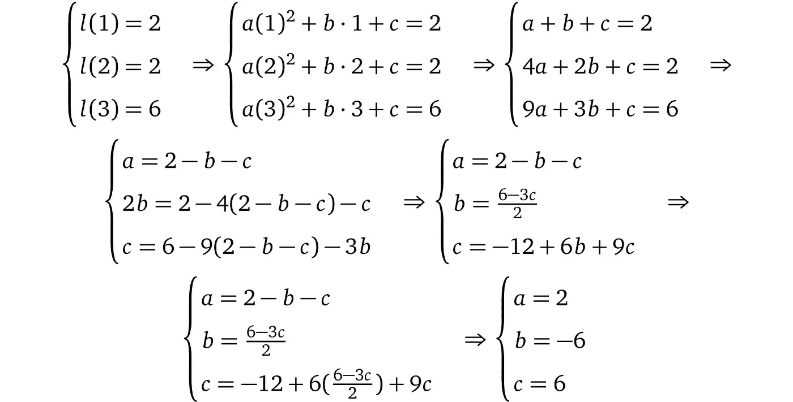
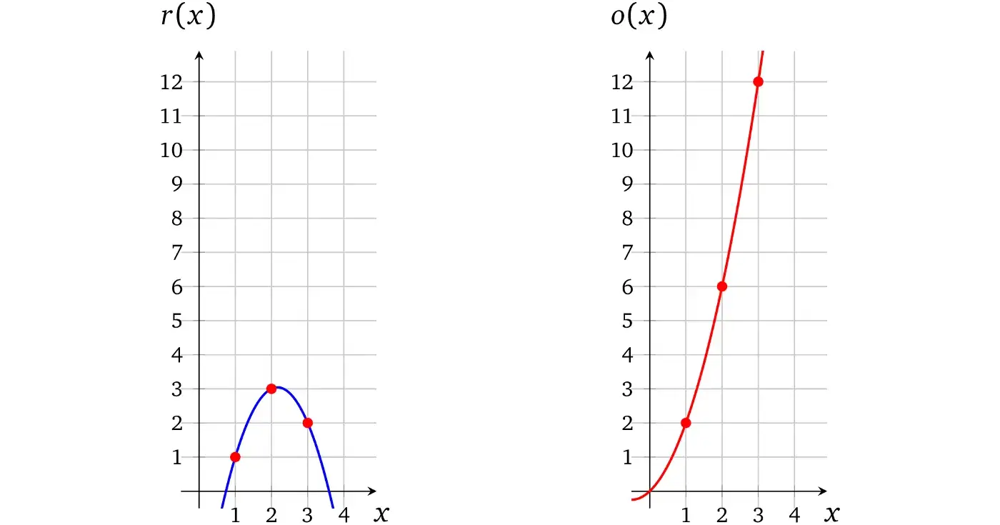
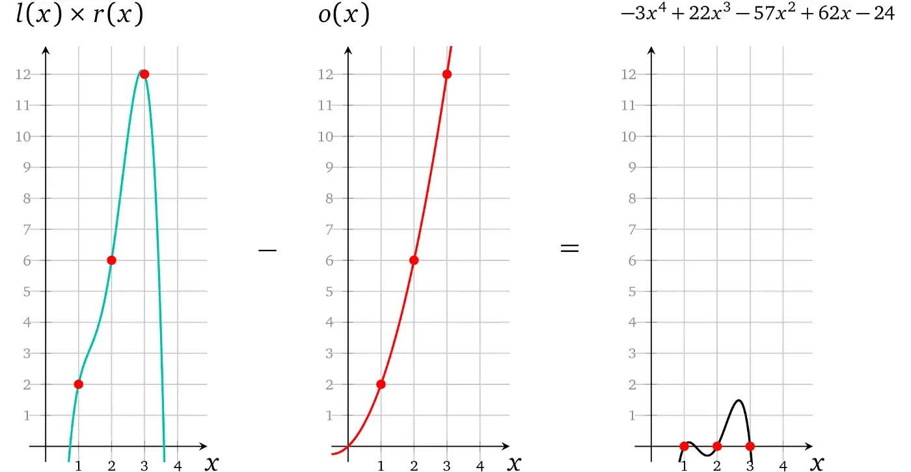
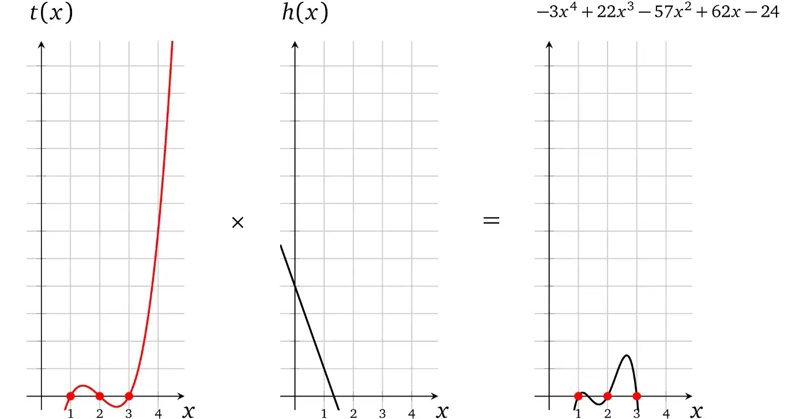

*原文：<Why and How zk-SNARK Works 4: General-Purpose Computation>*

*翻译：Junwei*

借助一个涉及大部分zk-SNARK机制的简单但实用的示例，我们已经铺垫好了方案，现在可以推进该方案来执行零知识程序。

# 计算

让我们考虑一个简单的伪代码程序：

```undefined
算法1：
function calc(w, a, b)        
    if w then        
        return a × b        
    else        
        return a + b        
    end  if        
end function
```

从高阶视角看，它与我们的多项式协议无关。因此我们需要找到一种方法将程序转换为多项式形式。第一步是将程序翻译成数学语言，这相对容易，同样的语句可以表示如下（假设$w$为 0 或 1）：

$$
f(w,a,b)=w(a\times b)+(1-w)(a+b)
$$
执行$calc(1, 4, 2)$和计算$f(1, 4, 2)$ 将得出相同的结果：8。相反，$calc(0, 4, 2)$和$f(0, 4, 2)$都会算出结果为6。我们可以用这种方式表示任意的有限程序。

那么（在这个例子中）我们需要证明的是，对于表达式$f(w,a,b)$，当输入为(1, 4, 2)时输出是 8，换句话说，我们检验等式：

$$
w(a\times b)+(1-w)(a+b)=8
$$

# 单步运算

我们现在有了用数学语言表示的通用计算，但我们仍然需要将其转化为多项式形式。让我们仔细看看什么是计算。任何计算的核心部分都由以下形式的基本运算组成：

<center>左运算数 <b>运算符</b> 右运算数 = 输出

运算符（例如 +、 –、 × 、 ÷）正在对两个运算数（即值）进行计算。例如，对于运算数2和3以及运算符“乘法”，它们将得出2 × 3 = 6。因为任何复杂的计算（或程序）都只是一系列运算，首先我们需要找出这样的运算如何用多项式来表示。

## 多项式的算术特性

让我们看看多项式与算术运算有何关系。例如，如果您取两个多项式$f(x)$和$g(x)$并尝试将它们相乘：$h(x) =f(x)×g(x)$，计算结果$h(x)$在任意点$x = r$的值将是$f(r)$和$g(r)$的求值结果的乘积。让我们考虑如下两个多项式：$f(x)=2x² – 9x + 10 $和$g(x) = – 4x ² + 15x – 9$。可视化的图表如下：


在$x = 1$时，它们求值分别为：$f(1) = 2 – 9 + 10 = 3， g(1) = – 4 + 15 – 9 = 2$。将两个多项式相乘：$h(x)=f(x) × g(x) = – 8x⁴ + 66x³ – 193x² + 231x – 90$。乘法的图表形式如下：


如果我们检验结果多项式$f(x) × g(x)$ 在$x = 1$处的求值，我们将得到：$h(1) = – 8 + 66 – 193 + 231 – 90 = 6$，等于$ f(x)$和$g(x)$在$x=1$时的乘积，并且在其他的点x时也是一样。

同样，如果我们将$f ( x ) $和$g ( x ) $相加，我们将得到$–2 x ² + 6 x + 1$，在$x = 1$时求值为 5。


> *注意：其他点x处的求值也被加在一起，例如，检验$x = 2，x = 3$。*

如果我们可以将运算数表示为多项式（我们确实可以这样），那么通过算术属性，我们将能够获得运算符计算后的结果。

## 执行运算

如果证明者声称拥有两个数字相乘的结果，验证者如何检查？为了证明单步运算的正确性，我们必须执行提供的运算数来检验输出（结果）的正确性。如果我们再看一下运算形式：

<center>左运算数 <b>运算符</b> 右运算数 = 输出

同样可以表示为一个多项式运算：

$$
l(x)\ 运算符\ r(x) = o(x)
$$
对于给定的$a$：

- $l(x)$ — 在a点表示（求值为）左运算数的值

- $r(x)$ — a点代表右运算数的值

- $o(x) $— a点表示运算的结果（输出）

因此，如果这些多项式运算正确地表示了运算数和输出，则$ l(a)\ 运算符\ r(a) = o(a)$的计算应当成立。将输出多项式$o(x)$移到等式左侧则$l(a)\ 运算符\ r(a) – o(a) = 0$，如果输出多项式$o(x)$表示的值，是运算符对运算数多项式$l(x)$和$r(x)$表示的值正确计算的结果，表明运算多项式$ l(x)\ 运算符\ r(x) – o (x)$求值肯定 0 。也就是说，如果多项式运算是有效的，它肯定有根$a$，因此，它肯定包含我们之前构建的因式$(x – a)$（详见 [因式分解部分](https://medium.com/@imolfar/why-and-how-zk-snark-works-2-proving-knowledge-of-a-polynomial-f817760e2805#2fe7)），也就是我们所证明的目标多项式，即$t(x) = x – a$。

例如，让我们考虑运算：

$$
3\times2=6
$$
它可以用简单的多项式表示$l(x) = 3x$ ,$ r(x) = 2x $,$ o(x) = 6x$，对应$a = 1$相应求值，即 $l(1) = 3; r(1) = 2; o(1) = 6。$


> *注意：“$a$”的值可以是任意的。*

运算多项式则为：

$$
l(x)\times r(x)=o(x)\\
3x\times 2x=6x\\
6x^2-6x=0
$$
可视化为：


值得注意的是，运算多项式有$(x – 1)$的因式：

$$
6x^2-6x=6x(x-1)
$$
因此，如果证明者提供这样的多项式$l(x)、r(x) 、o(x)$而不是之前的$p(x)$，那么验证者将接受它是有效的，因为它可以被$t(x)$整除。相反，如果证明者试图作弊将输出值替换为4，例如$o(x) = 4x$，则运算多项式将变成$6x^2 – 4x = 0：$


而它没有解$x = 1$，因此$l(x) × r(x) – o(x)$ 不能被$t(x)$在没有余数的情况下整除：


因此，这种不一致的运算将不会被验证者接受（如[因式分解部分](https://medium.com/@imolfar/why-and-how-zk-snark-works-2-proving-knowledge-of-a-polynomial-f817760e2805#2fe7)所述）。

# 运算证明

让我们修改我们最新的协议以支持单步乘法运算证明。回想一下，[之前](https://medium.com/@imolfar/why-and-how-zk-snark-works-3-non-interactivity-distributed-setup-c0310c0e5d1c#d1b1)我们有多项式知识p(x)的证明，但现在我们需要处理三个多项式$l(x)、r(x)、o(x)$。虽然我们可以定义$p(x) = l(x) × r(x) – o(x) $，但有两个相悖的地方。首先，在我们的协议中，加密值的乘法（即$l(s) × r(s)$) 在证明阶段是不可行的，因为配对只能使用一次并且需要进行“多项式约束”检查。其次，这将为证明者留下一个机会，可以随意修改多项式的结构，但仍然保持有效的因式$t(x)$，例如$p(x) = l(x)$ 或$p(x) = l(x) – r(x) $甚至$p(x) = l(x) × r(x) + o(x)$，只要保证$p(x)$有根$a$。这种修改实际上意味着证明有可能背后是不同的声明，这当然不是我们所希望的。

这就是证明者必须单独提供多项式$l(s)、r(s)、o(s)$求值的原因。这意味着必须调整多项式知识。本质上验证者需要在加密空间中检验的是$l(s) × r(s) – o(s) = t(s)h(s)$。虽然验证者可以使用密码学配对执行乘法，但减法$(–o(x)$)是一个成本极高的运算（需要找到$g^{o(s)}$的倒数），这就是为什么我们将$o(x)$移到等式的右边的原因：$l(x)r(x) = t(x)h(x) + o(x)$。在加密空间中验证者的检验转换成了：

$$
e(g^{l(s)},g^{r(s)})=e(g^{t(s)},g^{h(s)})·e(g^{o(s)},g)\\
e(g,g)^{l(s)r(s)}=e(g,g)^{t(s)h(s)}·e(g,g)^{o(s)}\\
e(g,g)^{l(s)r(s)}=e(g,g)^{t(s)h(s)+o(s)}
$$

> *注意：回想一下，密码学配对的结果支持通过乘法进行加密加法，参考[配对部分](https://medium.com/@imolfar/why-and-how-zk-snark-works-3-non-interactivity-distributed-setup-c0310c0e5d1c#f62b)。*

设置阶段保持不变，而协议更新后如下：

- 证明

  - 赋值$$l(x),r(x),o(x) $$的对应系数
  - 计算多项式$$h(x)=\frac{l(x)\times r(x)-o(x)}{t(x)} $$
  - 利用$${g^{s^i}}_{i \in [d]} $$进行加密多项式求值$$g^{l(s)},g^{r(s)},g^{h(s)} $$
  - 利用$${g^{\alpha s^i}}_{i \in [d]} $$进行加密后的位移多项式求值$$g^{\alpha l(s)},g^{\alpha r(s)},g^{\alpha h(s)} $$
  - 设定证明$$\pi=(g^{l(s)},g^{r(s)},g^{o(s)},g^{h(s)},g^{\alpha l(s)},g^{\alpha r(s)},g^{\alpha o(s)}) $$

- 验证
  - 解析证明$$\pi $$为$$(g^l,g^r,g^o,g^h,g^{l^{'}},g^{r^{'}},g^{o^{'}}) $$
  - 检验多项式约束
  -  $$e(g^{l^{'}},g)=e(g^l,g^{\alpha}) $$

  -  $$e(g^{r^{'}},g)=e(g^r,g^{\alpha}) $$

  -  $$e(g^{o^{'}},g)=e(g^o,g^{\alpha}) $$

  - 检验运算有效性: $$e(g^l,g^r)=e(g^{t(s)},g^h)·e(g^o,g) $$

  上述的协议可以证明正确计算了两个值相乘。

  人们可能会注意到，在更新后的协议中，我们不得不放弃零知识部分。这样做的原因是为了使过渡更加简单。我们将在后面的部分中添加它。

  # 多步运算

  我们可以证明单步运算，但我们如何扩展来证明多步运算呢（这是我们的最终目标）？让我们尝试添加另一步运算。考虑计算连乘的情况：$a × b × c$。在基本运算模型中，这意味着两步运算：

  $$
  {\color{green}a}\times{\color{blue}b}={\color{red}r_1}\\
  {\color{green}r_1}\times{\color{blue}c}={\color{red}r_2}\\
  $$
  如前所述，我们可以通过使运算数多项式在任意$x$点，例如$x=1$时求值来表示这样的运算。有了多项式的这个性质并不限制我们在不同的$x$点表示其他值，例如$x=2$时:

  

  这种独立性允许我们同时执行两步运算，而不会将它们“混合”在一起（即不会互相影响）。满足上面两个点的多项式运算如下所示：

  

  可以看出运算多项式的根为$x = 1$ 和$x = 2$。因此两步运算都是正确的。

  让我们看一个三个连续的乘法的例子: $2×1×3×2$，它可以按如下方式计算：

  $$
  {\color{green}2}\times{\color{blue}1}={\color{red}2}\\
  {\color{green}2}\times{\color{blue}3}={\color{red}6}\\
  {\color{green}6}\times{\color{blue}2}={\color{red}12}\\
  $$
  
  
  我们需要将它们表示为运算数多项式，对于由$x∈ {1 , 2 , 3}$表示运算，$l(x)$分别为2、2和6，即通过点$(1, 2),(2, 2),(3, 6)$，同样地 $r(x) ∋ (1, 1) , (2, 3) , (3, 2)$，而$o ( x ) ∋ (1 , 2) , (2, 6) , (3 , 12)$。
  
  但是，我们如何找到通过这些点的多项式呢？对于任何通过多点的情况，我们必须使用一种特定的数学方法。
  
  ## 多项式插值
  
  为了构建运算数和输出多项式，我们需要一种方法，可以在给定通过一组点的情况下，生成多项式曲线，这种方法称为插值法。有如下多种可用的方法：
  
  - 方程组与未知数
  
  - 牛顿多项式
  
  - 内维尔算法
  
  - 拉格朗日多项式
  
  - 快速傅里叶变换
  
  让我们以第一个为例。这种方法的思想是存在一个唯一未知系数的$n$次多项式$p(x)$，它通过给定的$n + 1 $个点，使得对于每个点${(xᵢ, yᵢ )}, i ∈ [n +1]$，在$xᵢ$处多项式求值应等于$yᵢ$，即对于所有$i$，$p(x_i) = y_i$。在我们通过三个点的例子中，它将是如下形式的二次多项式：
  
  $$
  ax^2+bc+c=y
  $$
  让我们对左运算数多项式（绿色）中每个点的多项式求值得到等式，并通过用其他系数表示每个系数来求解方程组：

  

  因此左运算数多项式为：

  $$
  {\color{green}l(x)}=2x^2-6x+6
  $$
  
  
  对应下图：
  
  
  
  我们可以用同样的方法求得 r(x)和o(x)：
  
  $$
  {\color{blue}r(x)}=\frac{-3x^2+13x-8}{2};{\color{red}o(x)}=x^2+x
  $$
  

  ## 多项式表示多步运算

  现在我们有了表示三步运算的运算数多项式，让我们一步步看看如何验证每步运算的正确性。回想一下，验证者正在寻找等式 $l(x) × r(x) – o(x) = t(x)·h(x)$。在这种情况下，因为运算由点$x ∈ {1 , 2 , 3}$表示，目标多项式在这些$x$点求值肯定为0，换句话说，$t(x)$的根肯定是 1、2 和 3，其基本形式为：

  

  首先，$l(x)$ 和$ r(x)$ 相乘，结果是：

  

  其次，从$l(x) × r(x)$的结果中减去$o(x)$：

  

  已经可以看出每步运算数乘法都对应一个正确的根。最后一步，证明者需要提供一个有效的因式：
  
  $$
  h(x)=\frac{l(x)\times r(x)-o(x)}{t(x)}=\frac{-3x^4+22x^3-57x^2+62x-24}{(x-1)(x-2)(x-3)}
  $$
  使用长除法我们得到：
  
  
  
  当$h(x) = –3x + 4$时，验证者可以计算$t(x)·h(x)$：
  
  
  
  现在很显然$l(x) × r(x) – o(x) = t(x)·h(x)$，这也是我们用多项式表示运算所要证明的。