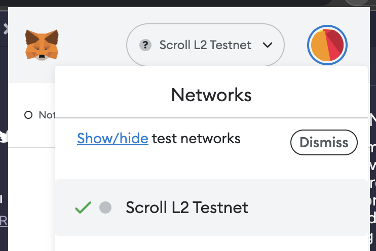

# 开发者快速上手

在 Scroll 上，你最喜欢的智能合约开发测试工具都可以正常使用。

由于 Scroll 是字节码层面的 EVM 等效，你只需将你的开发工具指向 Scroll Pre-Alpha Testnet RPC Provider。

如果你遇到任何问题，请联系[我们的 Discord](https://discord.gg/scroll)。

## 获取测试网ETH

要获得 TSETH，请访问我们的水龙头。然后，使用我们的跨链桥将 TSETH 桥接到 Scroll Pre-Alpha 测试网（第Layer 2）。

如需详细指引，可以从用​​户指南的[设置](/user-guide/setup)页面开始。

## 网络配置

使用下表将您的以太坊工具配置到 Scroll Pre-Alpha 测试网。

| 网络名称 | Scroll L1测试网                                                        | Scroll L2测试网                   |
| -------- | ---------------------------------------------------------------------- | --------------------------------- |
| RPC URL  | [https://prealpha-rpc.scroll.io/l1](https://prealpha-rpc.scroll.io/l1) | https://prealpha-rpc.scroll.io/l2 |
| Chain ID | 534351                                                                 | 534354                            |
| 代币符号 | TSETH                                                                  | TSETH                             |
| Block Explorer URL   |   [https://l1scan.scroll.io/](https://l1scan.scroll.io/)                                                                     |          [https://l2scan.scroll.io/](https://l2scan.scroll.io/)                         |


## 配置工具

### Hardhat

修改你的 Hardhat 配置文件`hardhat.config.ts`以指向 Scroll Pre-Alpha 测试网公开 RPC。
```
...

const config: HardhatUserConfig = {
  ...
  networks: {
    scrollPrealpha: {
      url: "https://prealpha-rpc.scroll.io/l2" || "",
      accounts:
        process.env.PRIVATE_KEY !== undefined ? [process.env.PRIVATE_KEY] : [],
    },
  },
};

...
```

### Foundary

要使用 Scroll Pre-Alpha 测试网公共 RPC 进行部署，请运行：

`forge create ... --rpc-url=https://prealpha-rpc.scroll.io/l2`

### Remix Web IDE

编译合约后，使用 Remix 进行部署的最简单方法是[设置 Metamask](/user-guide/setup)，然后选择“Scroll L2 Testnet”网络。


<center>在MetaMask中选择 Scroll L2 Testnet 作为网络</center>

现在，在“Deploy and Run Transactions”选项卡中，点击“Environment”下拉菜单并选择“Injected Provider - MetaMask”。


<center> 在Remix中，使用 MetaMask 作为Network Provider以访问 Scroll Pre-Alpha 测试网</center>

连接你的钱包并选择 Scroll Pre-Alpha Testnet L2。在 Remix 中应该会自动选择帐户，然后你单击“部署”即可。

### Truffle

假设你已经设置了 truffle 环境，请到 Truffle[配置文件](https://trufflesuite.com/docs/truffle/reference/configuration/) `truffle.js`，并确保已经安装了 HDWalletProvider：`npm install @truffle/hdwallet-provider@1.4.0`

```
const HDWalletProvider = require("@truffle/hdwallet-provider")
...
module.exports = {
  networks: {
    scrollPrealpha: {
      provider: () =>
        newHDWalletProvider(process.env.PRIVATE_KEY, "https://prealpha-rpc.scroll.io/l2"),
      network_id: '*',
    },
  }
}
```

### Brownie

要添加 Scroll Pre-Alpha 测试网，请运行以下命令：

```
brownie networks add Ethereum scrollPrealpha host=https://prealpha-rpc.scroll.io/l2 chainid=534354
```

要将其设置为默认网络，请在项目配置文件中添加以下内容：

```
networks:
    default: scrollPrealpha
```

### ether.js

在`ethers`脚本中设置 Scroll Pre-Alpha Testnet Provider。

```
import { ethers } from 'ethers';

const provider = new ethers.providers.JsonRpcProvider(
  'https://prealpha-rpc.scroll.io/l2'
);
```

### scaffold-eth

要使用 Scaffold-eth 进行部署，你需要将 Hardhat 和 React 设置指向 Scroll Pre-Alpha 测试网。

#### 配置Hardhat

在`packages/hardhat/hardhat.config.js`文件中，你需要添加网络并选择其为默认网络。

```
...
//
// Select the network you want to deploy to here:
//
const defaultNetwork = "scrollPrealpha";
...
module.exports = {
...
	networks: {
...
          scrollPrealpha: {
            url: "https://prealpha-rpc.scroll.io/l2",
            accounts: {
              mnemonic: mnemonic(),
            },
          },
	}
...
}
```

确保为部署的钱包充值了资金！

#### 配置前端

要配置你的前端，你需要添加 Scroll Pre-Alpha Testnet 作为网络，然后选择它为默认设置。

添加网络，请修改`packages/react-app/src/constants.js`.

```
...
export const NETWORKS = {
...
  scrollPrealpha: {
    name: "scrollPrealpha",
    color: "#e9d0b8",
    chainId: 534354,
    rpcUrl: "https://prealpha-rpc.scroll.io/l2",
    blockExplorer: "https://l2scan.scroll.io/",
  },
...
}
```

接下来，修改`packages/react-app/src/App.jsx`

```
...
/// 📡 What chain are your contracts deployed to?
const initialNetwork = NETWORKS.scrollPrealpha;
...
```