此次研讨会中，Scroll的ZK电路工程师 Mason Liang 介绍了如何在halo2-ce环境中开始构建和测试电路。通过提供的Github模板(https://github.com/scroll-tech/zk-mooc-halo2)，你将学习到如何在halo2-ce中构建零知识电路，halo2-ce 是以太坊基金会PSE团队的zkevm项目使用的证明系统的扩展。

此次研讨会是为了支持由伯克利RDI主办与ZKP MOOC合作举办的ZKP / Web3黑客马拉松。 ZK电路的第四个赛道中，要求开发者在halo2-ce的ZKP框架中构建和优化RIPEMD-160、Blake2f或SHA2-256哈希函数，Scroll将为获奖项目颁发15,000美元奖金。

研讨会主要分为三个部分，第一部分讲解了什么是Halo2，第二部分通过斐波那契数列等例子讲解了电路，第三部分讲解了以太坊的预编译。

Halo2是一个基于Plonk的证明系统。电路中包含了见证(Witnesses)和约束(Constraints)的矩阵。
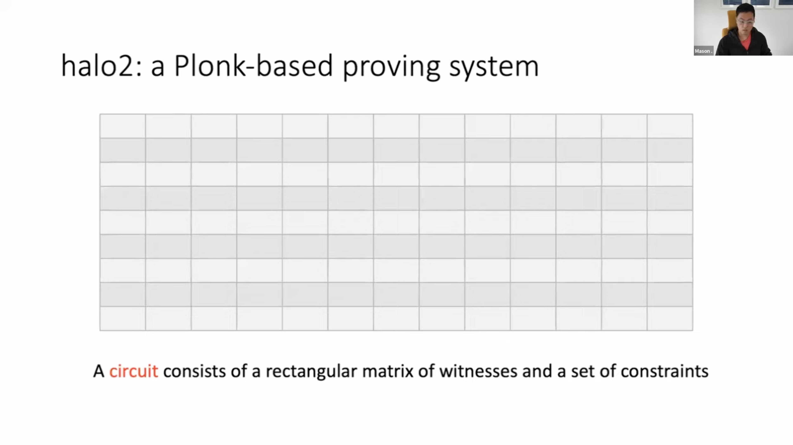
如下图所示，通常有 $2^k$ 行，$m$ 列，单元格值为有限域中 $\mathbb{F}_q$ 的元素
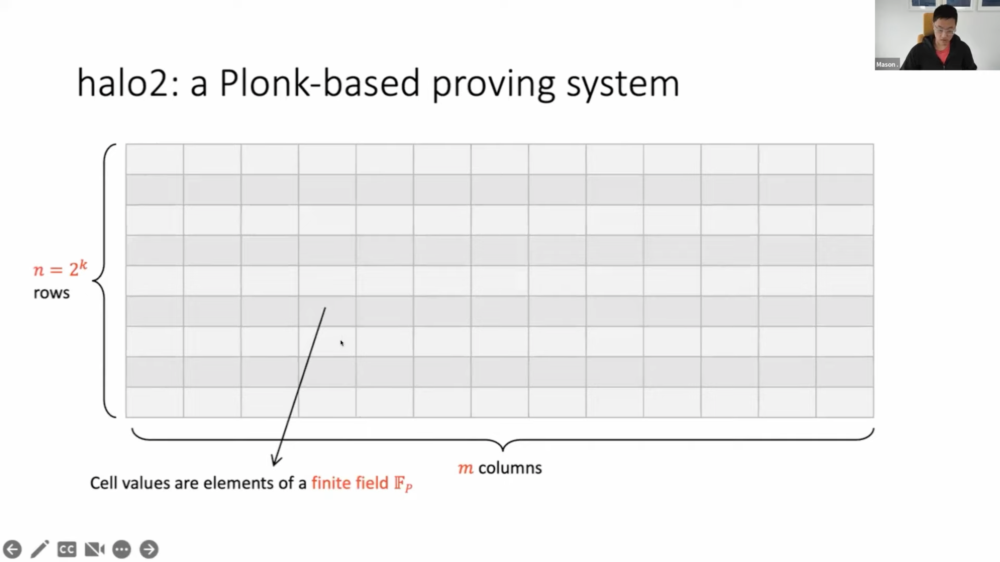
对每列 $i$, 构建一个拉格朗日多项式 $a_i(x)$ ，在第 $j$ 行时，单元格 $A_{i,j} = a_i(\omega ^j)$，其中 $\omega$ 是 $n$ 次单位根。
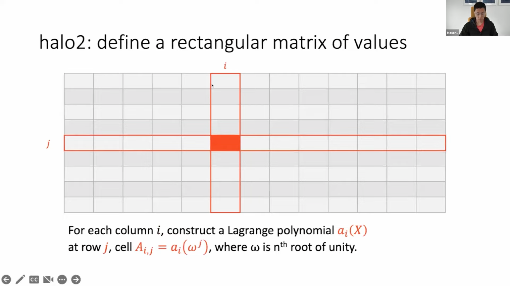

在Halo2中，有四种不同类型的列：advice列，instance列，fixed列，selector列。其中
- advice列包含隐私输入和见证
- instance列包含公开输入
- fixed列包含常数和查找表
- selector列包含控制门
advice列和instance列会随着证明变化，fixed列和selector列是刻写进电路。
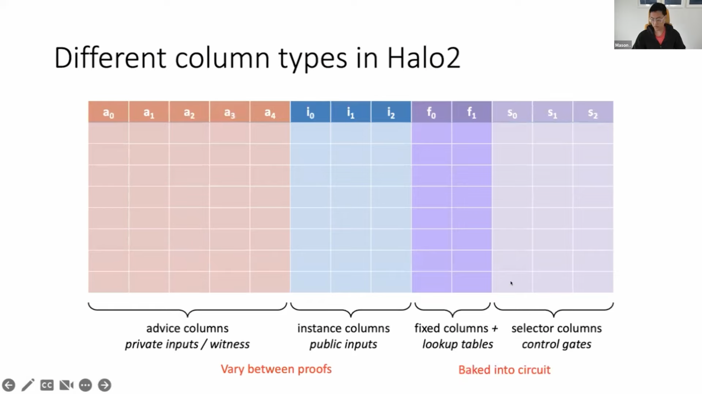
Halo2证明系统一大特点是支持自定义门，定义不同单元格之间的多项式约束关系，并使用selector列来控制自定义门的开关，并且在同一个自定义门中，不需要单元格保证连续。
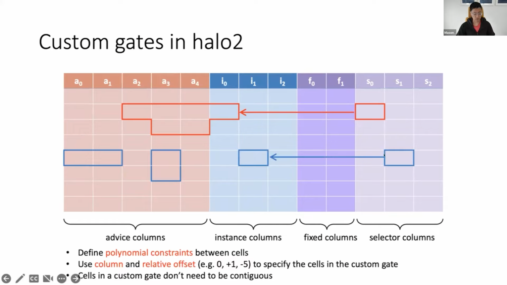
Halo2 的另一大特色是 Permuation，即等价性校验 (equality checks)。其是刻写在电路中，可以用来检查不同单元格的等价性，常用于关联电路中的不同小工具 (gadget)。

Halo2 还支持查找表。我们可以查找表理解成变量之间存在一个关系，该关系可以表示成一个表。在 Scroll 的 zkEVM 中，查找表可以用来验证复杂的操作，例如SHA3, EXP等。这样的策略类似于在正常的程序中，用内存换CPU的方法来提高性能。
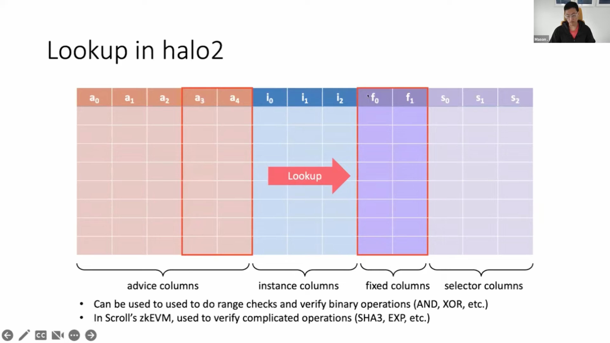
总结一下，Halo2同时支持自定义门和查找表，可以非常灵活的满足不同的电路需要，其模块化的设计可以替换后端方案。
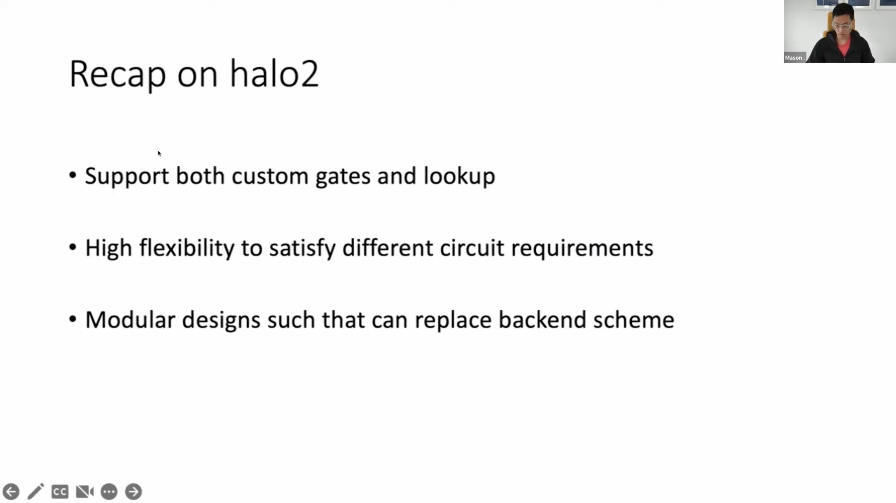
代码实现层面的列数据结构。

在约束系统中，创建四类不同列的对应方法
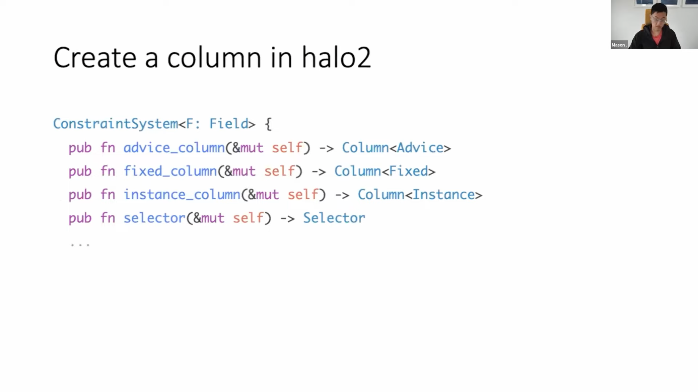
对每一列是否启用等价性校验的方法

创建自定义门的方法

创建查找表的方法
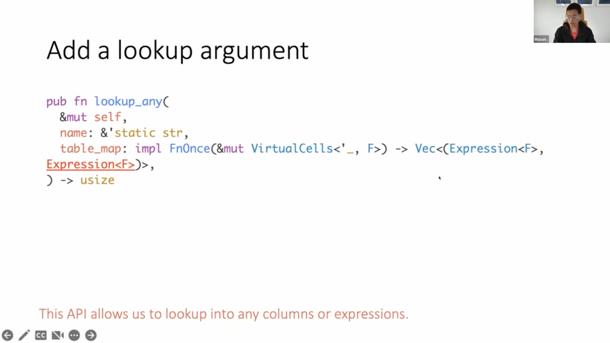
电路特征

总结一下，在Halo2中实现电路分成如下 4 步
1. 定义 Config 结构，说明电路中所使用的列
2. 定义 Chip 结构，配置电路中使用的约束并提供 assignment 函数
3. 定义实现了电路特征的电路结构
4. 实例化电路，并提供给证明者

第二部分讲解如何在Halo2实现斐波那契数列电路。

我们需要在给定 $f(0)=x,f(1)=y$ 的情况下，证明 $f(9)=z$

第一个示例中，设置三列 advice 列，依次放置 $f(x), f(x+1), f(x+2)$；selector 列中均设置为1，要求每一行的等式约束成立；instance 列的前三行放置 1, 1, 55
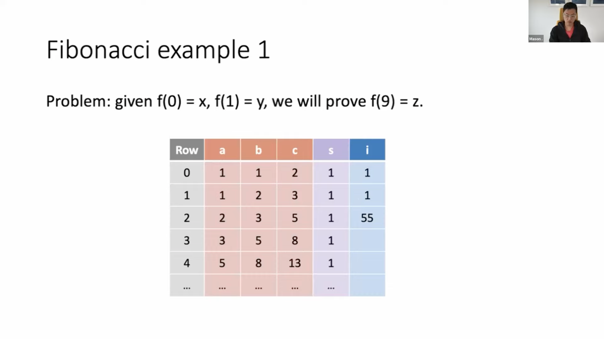
定义电路配置的代码如下

在创建自定义门中，我们实现了斐波那契数列的主要逻辑，要求 $S(x)*(A(x)+B(x)-C(x))=0$
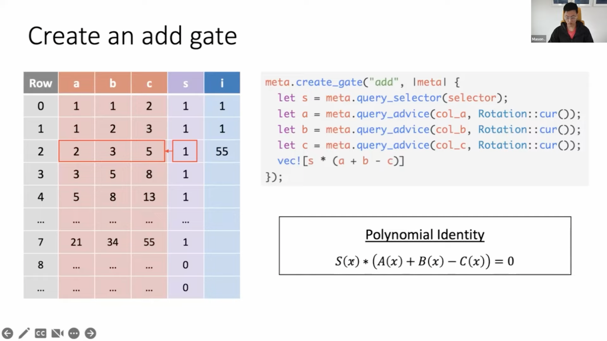
在此基础上，通过一致性校验，保证每一行斐波那契数列的连续性。
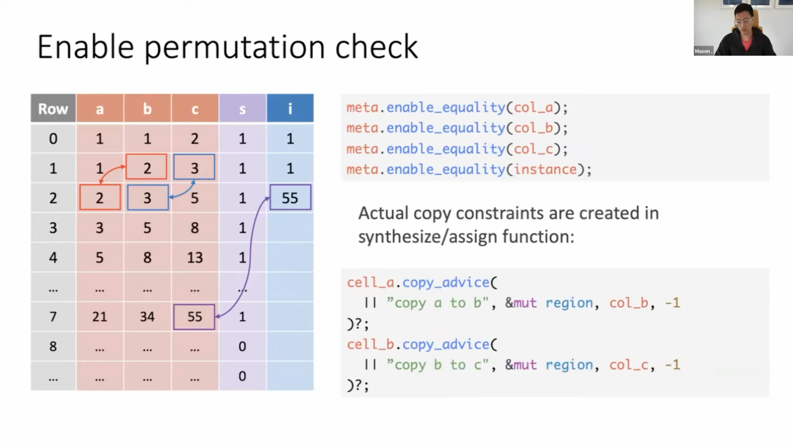

第二个示例中，我们仅设置一列 advice 列，在每一行依次放置斐波那契数列；selector 列仍然均设置为1，要求每一行的等式约束成立；instance 列的前三行仍然放置 1, 1, 55
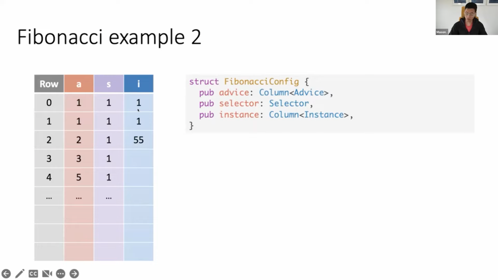
对应创建自定义门时，我们将约束改变为 $S(x)*(A(x)+A(\omega x)-A(\omega^2 x))=0$
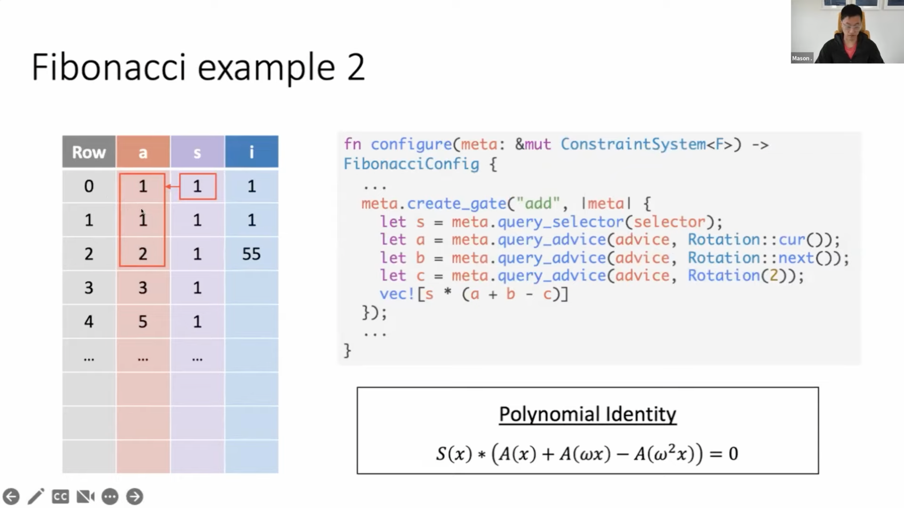

第三部分是本次黑客松相关的话题。0x02, 0x03, 0x09预编译合约分别对应了SHA2-256，RIPEMD-160和Blake2f哈希函数。

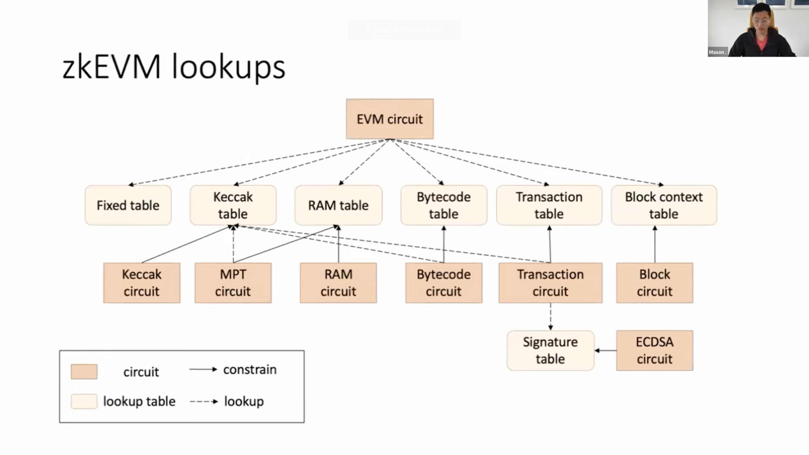
斐波那契数列的具体实现已经在 Haichen 的仓库中给出 https://github.com/icemelon/halo2-examples/tree/master/src/fibonacci ，Mason同样给出了一个平方剩余的例子，欢迎大家尝试挑战。

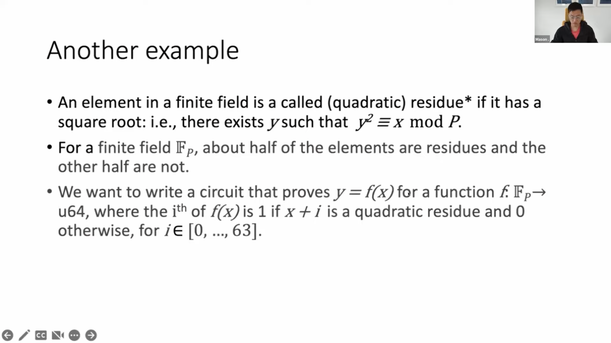

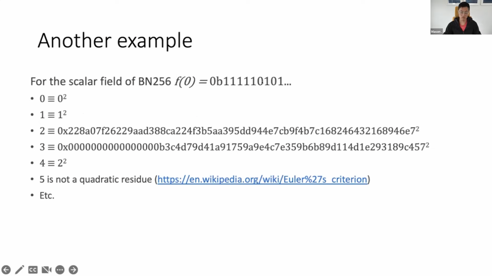

35:37 后是对代码实现的具体分析和演示。
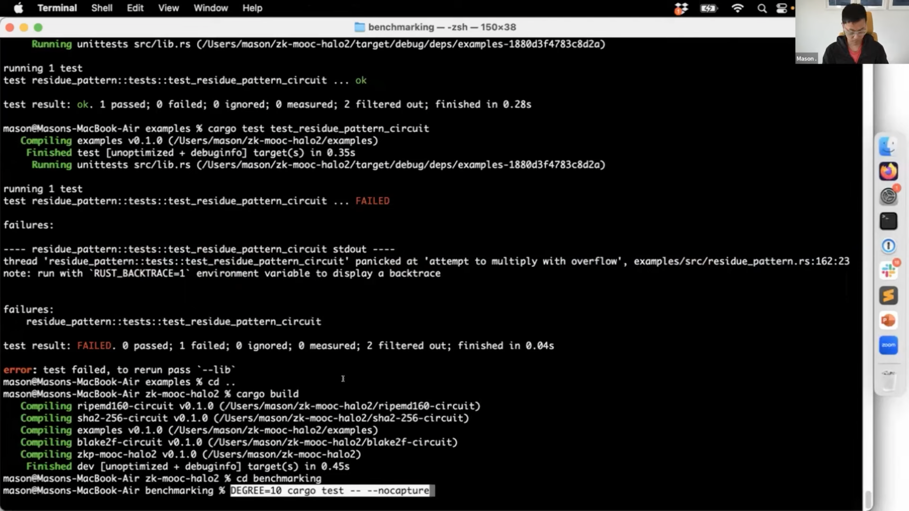